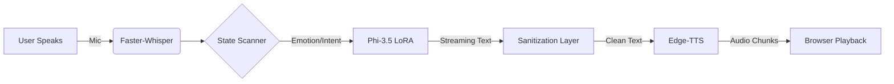

# 🧠 Tuesday Bot: Gen-Z Empathy in Voice & Vibe

> **"Spill the chaos. I’ll catch it."**

Tuesday is a real-time, voice-first AI companion built to feel like a late-night best friend. Not a therapist. Not corporate. Just someone who listens, understands the mood, and talks back in a way that actually feels human.

Powered by a custom mental-state classifier, a LoRA-tuned Phi-3.5 generator, and streaming neural TTS, Tuesday reacts in under **~3 seconds on GPU**. Late nights included. 💙

---

## ✨ Core Sparks

### 🧠 State Scanner (BERT-Derived)
A multi-task classifier that analyzes your audio transcript to detect:
* **Emotion:** Sadness, anxiety, joy, etc.
* **Intent:** Venting, advice, validation.
* **Risk Level & Intensity:** Determines how heavy the conversation is.

**Dynamic Response Modes:**
* `GENTLE_CHECK` → "that sucks, i’m here"
* `VIBE_CHECK` → Casual, slang-heavy replies
* `HYPE_SESSION` → 🔥 High energy matching
* `REAL_TALK` → Practical, grounded advice
* `CRISIS_SUPPORT` → Calm, stabilizing tone (No referrals)

### 🧩 Response Ritual (The LLM)
* **Base:** Microsoft Phi-3.5 Mini Instruct.
* **Fine-tuning:** LoRA-tuned for lowercase, casual syntax.
* **Sanitization Layer:** Strict filters remove "talk to a counselor," "seek professional help," and clinical hotline language.
* **Memory:** Short-term context window (last 6 turns).
* **Result:** Replies that sound like a person, not a policy document.

### 🎧 Audio Arc (Streaming)
* **Input:** `Faster-Whisper` (GPU) for rapid speech-to-text.
* **Output:** `Edge-TTS` for expressive neural voice.
* **Prosody Control:** Slower/lower pitch for comfort; faster/higher for hype.
* **Latency:** Streaming TTS chunks via WebSockets so playback starts before generation finishes.

### 🖥️ Interface Intimacy
* **Visuals:** Minimal Glass-style UI with a pulsing AI orb.
    * 🔴 Listening | 🟡 Thinking | 🟢 Speaking
* **Tech:** Vanilla HTML/CSS/JS. No frameworks. No bloat.

---

## 🛠️ Architecture Flow



---

## 🚀 Local Awakening

**Prerequisite:** A GPU is strongly recommended for low latency.

### 1. Clone
```bash
git clone [https://github.com/](https://github.com/)<your-username>/tuesday-bot.git
cd tuesday-bot
```

### 2. Activate Environment (Windows)
```powershell
backend\gpu_env\Scripts\Activate.ps1
# If PowerShell blocks it:
# Set-ExecutionPolicy RemoteSigned -Scope CurrentUser
```

### 3. Install Dependencies
```bash
pip install -r requirements.txt
```
*Recommended: PyTorch ≥ 2.5.1 + CUDA 12.1*

### 4. Add Models (Manual Step)
Models are excluded from git. Place them in the following structure:
```text
Tuesday_bot/
├── models/
│   └── mental_state_model_best.pth
└── phi35_genz_therapist_final/
    └── (HuggingFace snapshot files)
```

### 5. Run Backend
```bash
cd backend
uvicorn main:app --reload --host 0.0.0.0 --port 8000
```

### 6. Open Frontend
Simply open `frontend/index.html` in Chrome or Edge.
Tap the orb. Speak. Listen.

---

## 🧬 Model Intelligence

| Component | File/Folder | Details |
| :--- | :--- | :--- |
| **Classifier** | `mental_state_model_best.pth` | Transformer encoder with shared heads. Outputs 8 emotions, 3 intents, risk levels, and confidence scores. |
| **Generator** | `phi35_genz_therapist_final/` | Phi-3.5 Mini Instruct + LoRA adapter. Promoted for lowercase casual tone and anti-therapist language. |

> **Cloud Deployment Note:** The `tuesday_bot.py` script contains an optional auto-downloader using `huggingface_hub` if the models are missing locally.

---

## 🚫 Guardrails & Ethics

Tuesday is designed to be **human**, not legal.
* **Strict Removal:** Therapy referrals, hotlines, and clinical instructions are stripped from the output.
* **Crisis Mode:** Triggers a calm, stabilizing persona but **does not** hallucinate emergency resources.
* **Memory:** Stored in-process (RAM) only. Resets on server restart or via `/reset`.

---

## 🧪 Project Status

* ✅ Streaming WebSocket TTS
* ✅ Emotion-aware response switching
* ✅ GPU-accelerated inference
* ❌ User Authentication
* ❌ Long-term Database Memory

---

## 👤 Author

**Built by Harshal**
Focused on real ML systems, not demo toys.